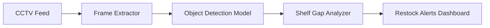

# Gosoft Retail Tech Hackathon — Smart Shelf Vision AI

> **Smart shelf monitoring via CCTV** — retail shelf gap detection with vision AI. Built for Gosoft Retail Tech Hackathon 2026 (CP ALL · AWS · depa · CMKL).

### Demo

### Architecture

### Results

| Metric | Value |
|---|---|
| **Achievement** | Certificate of Achievement — Innovation Contributor |
| **Panel** | AWS · depa · Thai Programmer Association |

---

**Phirawit Jitnarong — Strategic Full-Stack & AI Engineer**

xme176@gmail.com · 092-551-0427 · [LinkedIn](https://www.linkedin.com/in/%E0%B8%9E%E0%B8%B5%E0%B8%A3%E0%B8%A7%E0%B8%B4%E0%B8%8A%E0%B8%8D%E0%B9%8C-%E0%B8%88%E0%B8%B4%E0%B8%95%E0%B8%93%E0%B8%A3%E0%B8%87%E0%B8%84%E0%B9%8C-0000393a4) · [Fastwork](https://fastwork.co/user/bravforcode?source=search)

> Hiring for this stack? Let's talk — production hardened, 300k+ users shipped.